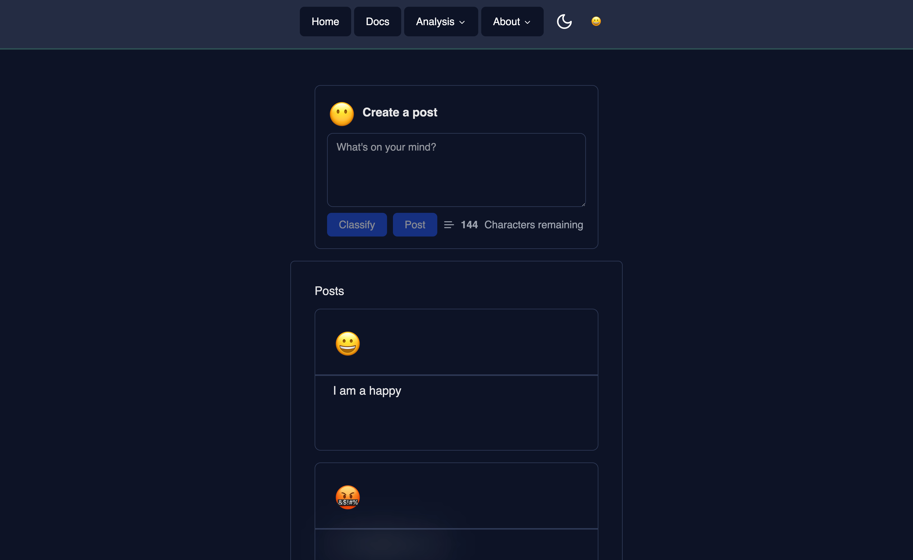
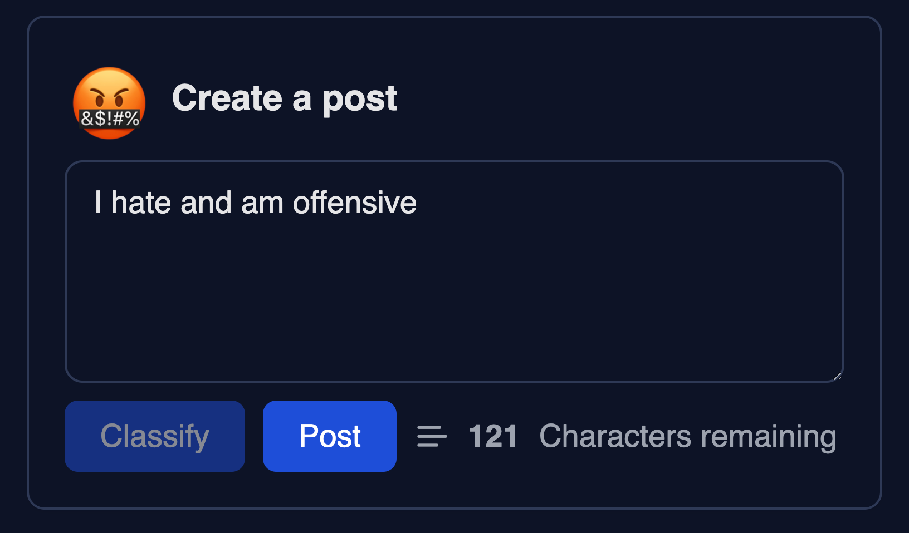
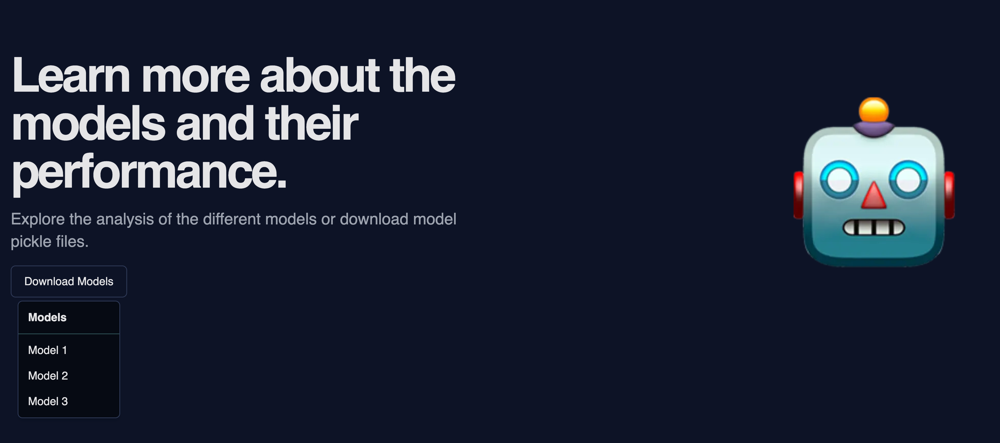
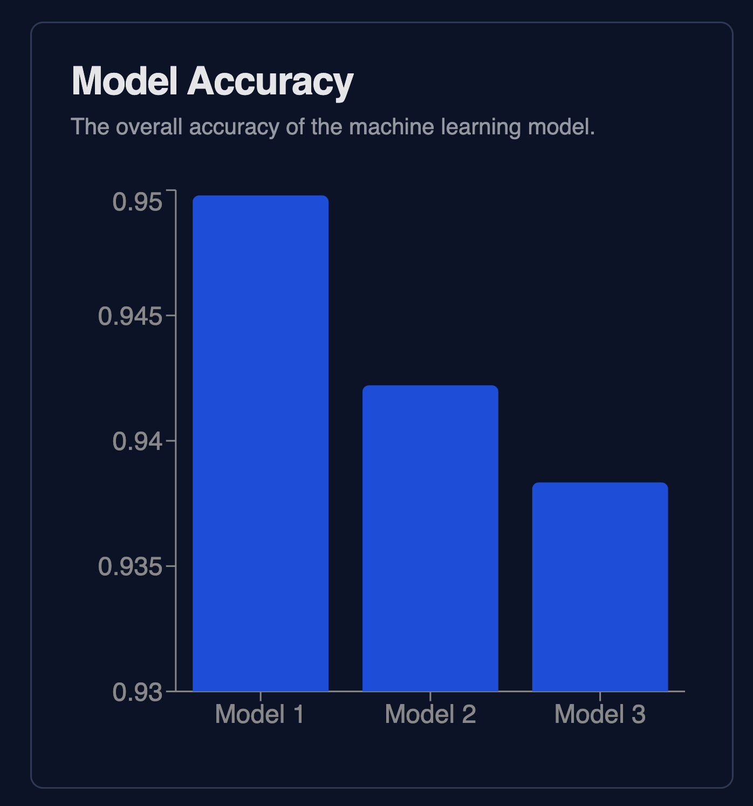
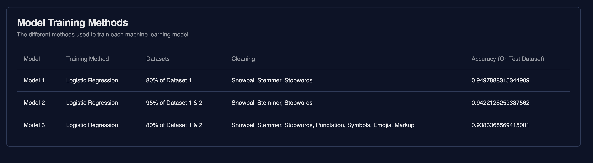
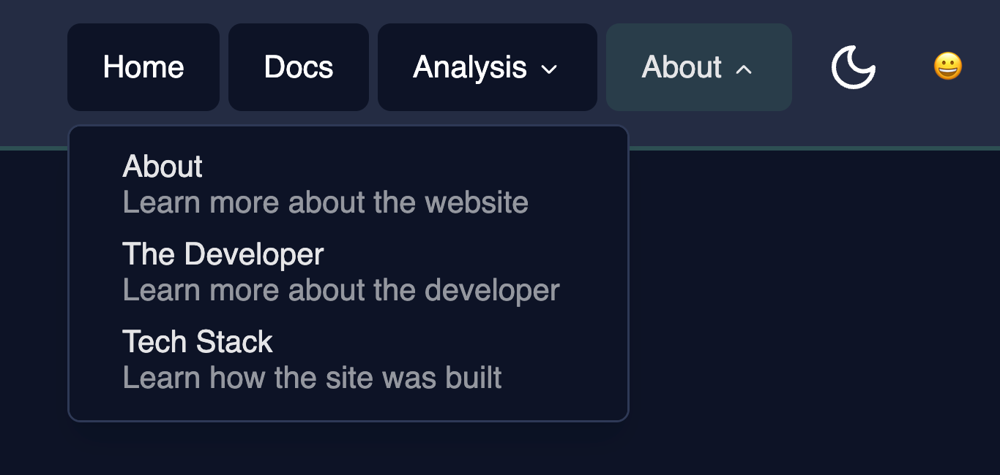
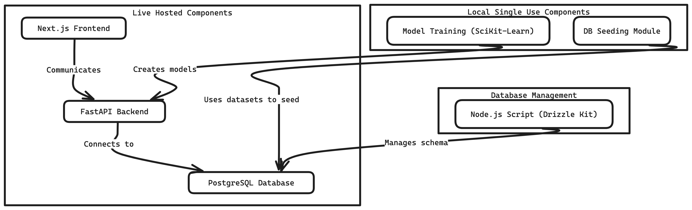

# Application

## Overview

The web application allows users to view and create posts to a public timeline that is automatically moderated using machine learning to classify posts for offensive content. Users will have the ability to view how the model classifies their posts and the posts of others. The application also features pages dedicated to giving an in-depth analysis of models and data where users can gain a better understanding of the machine learning moderation system.

## Links

- [Frontend](https://wgu-capstone-xavier-loera-flores.vercel.app)
- [Backend](https://wgu-capstone-production.up.railway.app/)
- [Live Docs](https://wgu-capstone-docs.vercel.app/)

## Files

- model: SciKit-Learn Machine Learning Model Python Files
- backend: FastAPI Python Server
- frontend: NextJS Web Application
- database: Drizzlekit PostgreSQL Database
- data: Seed Data for PostgreSQL Database
- docs: Insomnia Generated API Documentation
- project_management: Project Management Documentation
- insomnia.json: Insomnia Project File
- README.md: Project README File
- .gitignore: Git Ignore File

## Machine Learning Algorithm & Vectorizer

The machine learning algorithm used in this project is the Logistic Regression and the vectorizer method used in this project is the TF-IDF(Term Frequency Inverse Document Frequency) both of which have implementations in the SciKit-Learn library.

## User Interface

The user interface is built using the NextJS framework which is a ReactJS framework. The user interface is designed to be simple and responsive to work on all devices. The following are screenshots of key components of the user interface.

1. Home Page with Post Feed

2. Post Composer with Classification

3. Analysis Header 

4. Analysis Card with Data Chart

5. Data Table 

6. Navigation Header

## System Design

The live hosted components of the application consist of a Next.js frontend hosted on Vercel which communicates with a FastAPI backend hosted on Railway which itself connects to a PostgreSQL database hosted on Vercel. The other components of the system are hosted locally on the developer's machine and are run manually when needed. The PostgreSQL database is managed by a Node.js script using Drizzle Kit to manage the database schema. The backend server uses models created and saved from a Python script that uses the SciKit-Learn library to train a machine learning model. There is also a seeding module that uses the saved models to classify and seed the database with posts.

System Design Diagram:
